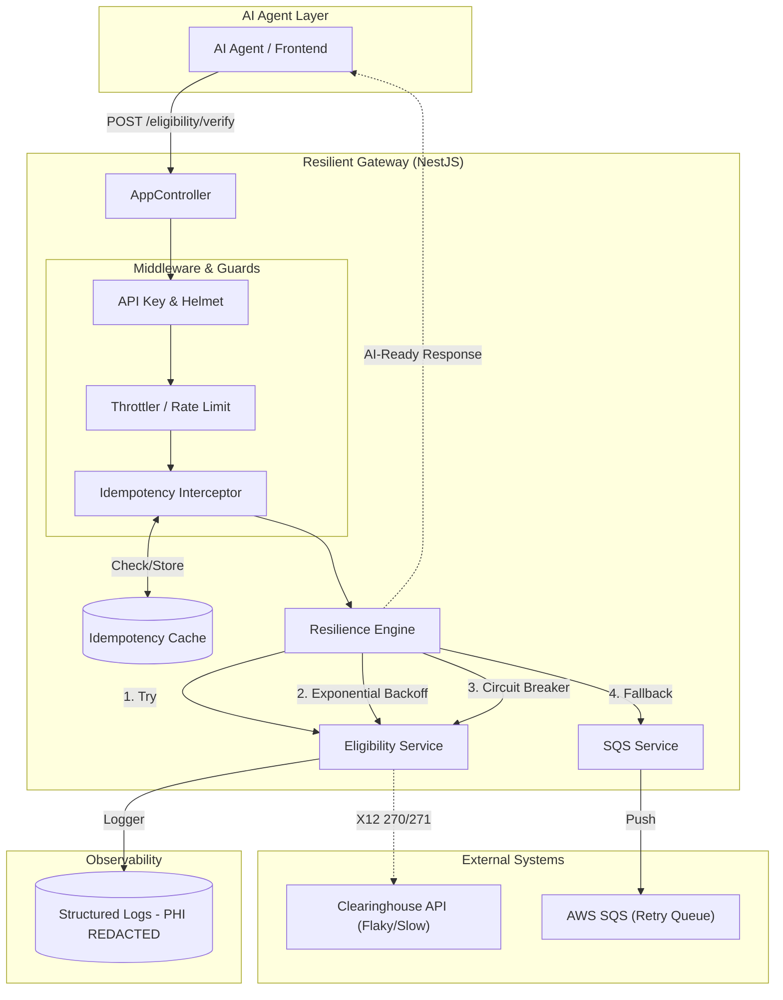

# Resilient RCM Eligibility Gateway

### Mission-Critical Resilience for Healthcare AI
The **Resilient RCM Eligibility Gateway** ensures consistent insurance verification for Healthcare AI Agents by shielding them from clearinghouse volatility.

**Key Resilience Mechanisms:**
*   **RxJS Layer**: Automatically handles transient network "blips" with 3x exponential retries (1s, 2s, 4s).
*   **Opossum Layer**: Monitors for sustained failures and "trips" the circuit to prevent system exhaustion.
*   **SQS Layer**: Spools failed or timed-out requests to AWS SQS for asynchronous processing, ensuring zero data loss.
*   **Deterministic Reliability**: Provides a stable interface so AI workflows never stall due to downstream outages.

## Architecture Diagram



## Resilience Engine: Opossum + RxJS

### The Resilience Lifecycle
1. **Request Ingress**: AI Agent sends a verification request.
2. **Inner Layer (RxJS Retries)**: Handles transient "blips" with 3x exponential retries.
3. **Outer Layer (Circuit Breaker)**: Monitors failure rates (50% threshold over 100+ calls) and "trips" the circuit to prevent system exhaustion.
4. **Fallback Layer (SQS)**: Any request that fails all retries—or hits an open circuit—is spooled to **AWS SQS** for async processing.
5. **Audit Trail (DLQ)**: Repeatedly failing requests are moved to an **audit-ready DLQ** for manual remediation.

## Production-Grade Features

### Security & Compliance
- **PHI Redaction**: Automatic scrubbing of patient information from all system logs to ensure HIPAA compliance.
- **API Security**: Guarded by `x-api-key` and **Helmet** security headers.
- **Input Validation**: Strict DTO validation to prevent malformed injections.

### Performance & AI Integration
- **Rate Limiting**: Protects downstream systems from AI Agent "loops" or traffic spikes.
- **Idempotency**: `x-idempotency-key` support via local cache to prevent duplicate RCM transactions.
- **AI-Optimized JSON**: Standardized responses allowing AI Agents to handle background states gracefully.

## Getting Started

### 1. Environment Configuration
Create a `.env` file in the root directory:
```env
CB_TIMEOUT=5000
CB_RESET_TIMEOUT=10000
CB_VOLUME_THRESHOLD=100
CB_ERROR_THRESHOLD=50
CB_WINDOW=10000
MOCK_FAILURE_RATE=0.6
SQS_QUEUE_URL=eligibility-retry-queue
AWS_REGION=us-east-1
API_KEY=secure-api-key
```

### 2. Installation
```bash
npm install
```

### 3. Running the Service
```bash
npm start
```

## Quick Start / API Example

The **AI Agent** (or automated producer) submits a standard JSON payload representing an eligibility inquiry. The gateway then translates and manages the resilience lifecycle.

### Request Body (POST /eligibility/verify)
```json
{
  "patient_name": "John Doe",
  "payer_id": "BCBS_001",
  "batch_id": "B_2026_01"
}
```

### Response Body (Success)
```json
{
  "status": "SUCCESS",
  "resolution_path": "DIRECT_CLEARINGHOUSE_API",
  "data": {
    "eligibility_status": "ACTIVE",
    "plan_details": "Comprehensive Coverage",
    "timestamp": "2026-01-02T20:48:41Z"
  }
}
```

### Response Body (Fallback/Queued)
When clearinghouses are down or slow:
```json
{
  "status": "QUEUED",
  "resolution_path": "SPOOL_TO_SQS",
  "message": "Eligibility request accepted for asynchronous processing",
  "reason": "Clearinghouse API Timeout"
}
```

## Testing Suite

### Unit Tests
```bash
npm test
```

### Production Ingestion Verification
```bash
npm run verify
```

### High-Scale Stress Testing
```bash
npm run stress
```

## Additional Resources
- [Cost Analysis: Circuit Breaker Implementation](file:///Users/sphoortimirji/llm/deterministic-gateway-for-ai-agents/COST_ANALYSIS.md)
- [The Bridge: JSON (AI) to X12 (Clearinghouse)](file:///Users/sphoortimirji/llm/deterministic-gateway-for-ai-agents/X12_BRIDGE.md)

## Domain Context
This service abstracts the complexity of **X12 270/271** eligibility transactions, providing a modern, reliable REST interface for next-gen healthcare AI Agents.
